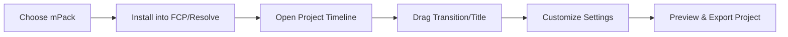

# MotionVFX mPacks – Professional Editing Plugins

**MotionVFX mPacks** are curated bundles of **plugins, templates, and effects** designed for Final Cut Pro and DaVinci Resolve editors. Whether you’re working on YouTube content, cinematic projects, or client work, mPacks provide ready-made transitions, titles, and overlays that cut hours off your workflow while keeping results professional.

Each pack is optimized to integrate seamlessly with your editing platform, giving you drag-and-drop speed with customizable controls.

---

## 🔎 Overview

MotionVFX is known for setting industry standards in motion graphics. With mPacks, the company delivers **all-in-one creative toolkits** covering:

* Dynamic transitions
* Stylish title templates
* Cinematic LUTs & grading presets
* Lower thirds, callouts, and social media assets

Instead of building effects from scratch, mPacks let you focus on storytelling and client delivery.

---

## ✨ Key Features

* **Drag & Drop Simplicity:** Apply transitions or titles directly in your timeline.
* **Customizable Controls:** Adjust fonts, colors, durations, and animations with ease.
* **Optimized Performance:** GPU-accelerated for smooth editing on macOS and Windows.
* **High Resolution Ready:** Works flawlessly with 4K, 6K, and even 8K projects.
* **Regular Updates:** New packs and content are added frequently.
* **Cross-Project Flexibility:** Ideal for commercials, social media, vlogs, and films.

---

## 🖥 Compatibility

mPacks integrate directly with the most popular editing platforms:

| Software        | Support               | Notes                |
| --------------- | --------------------- | -------------------- |
| Final Cut Pro   | Native plugin support | macOS only           |
| DaVinci Resolve | Fully compatible      | macOS & Windows      |
| Motion 5        | Extended editing      | For motion designers |

\[!NOTE]
No extra rendering engines or subscriptions are required. Install once, and the pack stays in your library.

---

## ⚡ Setup & Installation

Getting started with MotionVFX mPacks is simple:

1. Purchase or download your chosen mPack from MotionVFX.
2. Install using the provided installer or manually copy to the plugins folder.
3. Restart Final Cut Pro or Resolve to load the pack.
4. Access new effects under the **Titles, Transitions, or Effects** panel.
5. Drag onto your timeline and customize in the inspector.

Example inspector adjustments:

```plaintext
Title Font: Montserrat Bold
Animation Speed: 120%
Overlay Opacity: 65%
Color: #FF5733
```

---

## 📊 Workflow Diagram



---

## ❓ FAQ

**Q: Do mPacks slow down my editing software?**
A: No, they are optimized for GPU acceleration and tested for smooth playback.

**Q: Can I use mPacks in commercial projects?**
A: Yes, once purchased, they are licensed for professional and client work.

**Q: Do I need Motion 5 to use them in Final Cut Pro?**
A: No, Motion 5 is optional—Final Cut Pro supports them natively.

**Q: Are updates free?**
A: Purchased mPacks remain yours, and updates to that pack are free.

---

## 🚀 Final Thoughts

**MotionVFX mPacks** give editors a **professional creative edge** without the steep learning curve of building animations from scratch. Perfect for creators who value speed, quality, and modern design.


